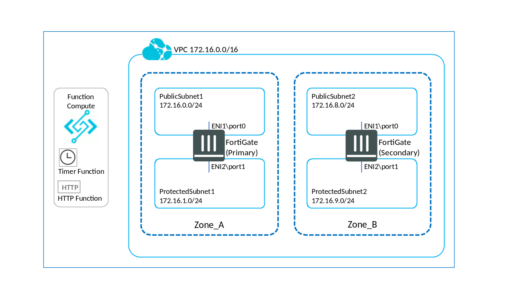

# Introduction

FortiGate Active-Active failover is a Function Compute and Terraform module that allows for failover of egress routes. The template deploys two functions which check the health of two FortiGates at regular intervals. If one of FortiGates fails a TCP health check, both egress routes are checked and the route is changed to the other FortiGate.

By default, the FortiGates are deployed with static IP addresses with a link monitor between them. If a change in the link status is detected, an Automation Stitch will call the health check function and begin the process of changing the routes to the healthy FortiGate. In addition, a timer function calls the health check function every minute.

The script supports multiple route tables which can be supplied as a comma separated list (no spaces) in the environment variable ROUTE_TABLE_ID.

The Terraform deployment supports different architectures:

1. Split egress traffic (default deployment)

   Two custom route tables will be created, one per Availability Zone (AZ). Each FortiGate will be set as the next hop for that AZ with a default route of 0.0.0.0/0.
   When a FortiGate fails, the egress route will switch to the other (healthy) FortiGate.
   When a FortiGate returns to a healthy state, the relevant routes will default back to it. This is currently achieved by looking at the custom name given to a route. By default, the custom routes within the route table will be given the name of an ENI to switch back to on a healthy state.

2. Pin to a specific FortiGate

   Traffic is set to route through a single FortiGate.
   On failover, the egress route will switch to the secondary FortiGate. On return to a healthy state, the route will switch back to the FortiGate specified in the environment variable PIN_TO.

3. Simple failover

   The environment variable PIN_TO is not set.
   On failover, the egress routes will switch to a healthy FortiGate. The routes will not switch back on return to a health state.

# Requirements

To deploy this template, a RAM user with an AccessKey and Secret are required. This user will need access to ECS, VPC, RAM, and FC. For details on creating a RAM user, refer to the AliCloud article [Create a RAM user](https://www.alibabacloud.com/help/doc-detail/28637.htm).

This deployment was tested using:

- Terraform 0.12.0+
- Terraform provider for AliCloud 1.70.2

# Deployment Overview

The Terraform script will create the following:

- A Function Compute service and two functions:
  - A timer function that runs once per minute
  - An HTTP function that will execute health checks and route changes.
- A Virtual Private Cloud (VPC)
- Two vswitches
- A route table with a default route to the primary FortiGate
- Two FortiGates in separate AZs
- A logging project and a logstore
- Two security groups, one for internal and one for external
- An AliCloud RAM policy

The default setup is shown below:



# Deployment

> **Note:** A RAM user with access to ECS/VPC/RAM/FC is required.

1. Unzip the FortiGate Active-Active failover package.
2. In the root directory run `terraform init`.
3. Confirm and apply the plan with the command:
   ```sh
   terraform apply -var access_key="<access_key>" -var secret_key="<secret_key>"
   ```
   Alternatively, place variables into `vars.tf` or a variables file.

To deploy the second architecture (pin to a specific FortiGate), add the var `split_egress_traffic=false`:

```sh
terraform apply -var access_key="<access_key>" -var secret_key="<secret_key>" -var split_egress_traffic=false
```

To destroy the created resources, run the command:

```sh
terraform destroy -var access_key="<access_key>" -var secret_key="<secret_key>"
```

The FortiGate configurations deployed using `cloud-init` can be found under `ConfigScripts/` and can be used to configure the deployment as needed.

# Troubleshooting

The following is a guide to some common errors you may encounter.

> **Message**: Error: [ERROR] terraform-provider-alicloud/alicloud/resource_alicloud_log_project.go:61:
> Resource alicloud_log_project CreateProject Failed!!! [SDK aliyun-log-go-sdk ERROR]

This error is most likely due to a timeout. The solution is to re-run the`terraform -apply` command.

> **Message**: Error: [ERROR] terraform-provider-alicloud/alicloud/resource_alicloud_instance.go:382: [ERROR] terraform-provider-alicloud/alicloud/service_alicloud_ecs.go:409: The instance type ecs.c5.large is solded out or is not supported in the zone <zone>

This error indicates a resource constraint. The solution is to change the instance type.

> **Message**: Warning: Interpolation-only expressions are deprecated

This warning is due to syntax differences between 0.11 and 0.12. These syntax differences are incompatible with this Terraform file. Ensure you are using Terraform 0.12+.

# Support

Fortinet-provided scripts in this and other GitHub projects do not fall under the regular Fortinet technical support scope and are not supported by FortiCare Support Services.
For direct issues, please refer to the [Issues](https://github.com/fortinet/azure-function-load-balancer-rule-sync/issues) tab of this GitHub project.
For other questions related to this project, contact [github@fortinet.com](mailto:github@fortinet.com).

## License

[License](./LICENSE) © Fortinet Technologies. All rights reserved.
